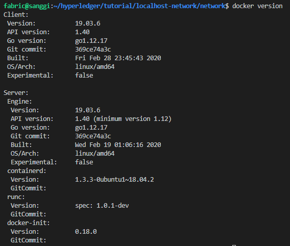
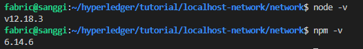
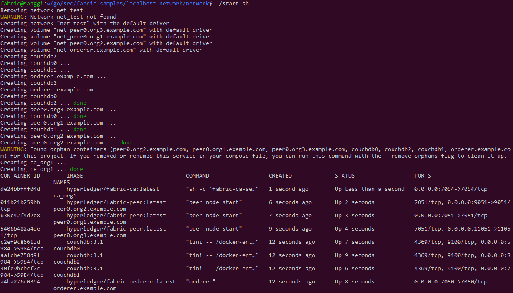
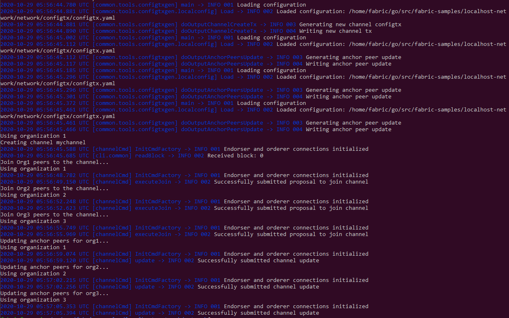
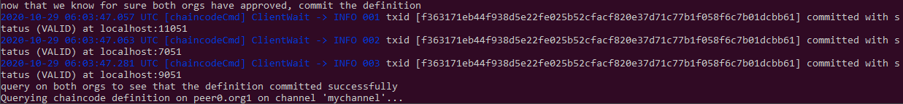

## hyperledger v2.2 localhost network 구축

하이퍼레저 v2.2를 활용하여 단일 host에서 여러개의 컨테이너로 네트워크를 구축함.<br>
<br>
* Operating system: 18.04.02 LTS live-server
* Go version: 1.14
* NodeJS version: 12.18.3
* NPM version: 6.14.6
* Channel: mychannel
* Organization: Org1, Org2, Org3
* CA: 1개(Org1)
* DB: CouchDB
* TLS: false
* Consensus Type: Solo

## 1. Docker 설치

```
$ sudo apt install docker.io
$ sudo apt install docker-compose
$ sudo apt install software-properties-common
$ sudo usermod -aG docker $USER
$ sudo reboot
$ docker version 

```
<br>

## 2. nodeJS 설치

```
$ sudo apt-get update 
$ sudo apt-get install build-essential libssl-dev
$ curl -sL http://raw.githubusercontent.com/creationix/nvm/v0.31.0/install.sh -o install_nvm.sh
$ bash install_nvm.sh 
$ source ~/.profile
$ sudo reboot
$ nvm install v12.18.3
$ node -v
$ npm -v 
```
<br>

## 3. Hyperledger fabric samples v2.2 설치
```
$ mkdir -p $HOME/go/{src,pkg,bin}
$ cd ~/go/src
$ curl -sSL http://bit.ly/2ysbOFE | bash -s -- 2.2.0 1.4.7
$ sudo apt install vim
$ sudo vim ~/.profile
  아래 참고하여 환경변수 등록
$ source ~/.profile
```
<br>
## 4. localhost-network 디렉토리 이동
다운 받은 localhost-network 디렉토리를 설치한 fabric-samples 디렉토리로 이동 시킴.<br>
이후, fabric-samples 디렉토리에서 작업 진행
```
$ mv $HOME/hyperledger/tutorial/localhost-network/ $HOME/go/src/fabric-samples/
$ cd $HOME/go/src/fabric-samples
```

## 5. 네트워크 구성 및 확장
### 5.1 localhost-network directory 구성정보
* application: hyperledger network 연동 및 admin, user 등록
* contract: chaincode(fabcar)
* network: 네트워크 구축
<br>
<br>

### 5.2 네트워크 구동을 위한 사전 작업
* Peer, Orderer의 MSP 구성 및 genesis block 생성.
* 이때 CA는 Org1의 CA를 의미함.
* 간단한 실습을 위해 Org1에만 CA를 구동 하였으며, 각 Org에 CA서버를 구동하는 것이 좋음.
```
$ cd $HOME/go/src/faric-samples/localhost-network/network
$ ./generate.sh
```
<br>

### 5.3 네트워크 구동 
* Peer, Orderer, CA 컨테이너 구동
* mychannel 생성
* 각 Org내 Peer별 mychannel 가입
* 각 Org내 AnchoPeer 업데이트
```
$ cd $HOME/go/src/faric-samples/localhost-network/network
$ ./start.sh
$ docker ps -a
```
<br>
<br>

## 6. 체인코드 설치
* 패키징(packaging)
* 각 Org내 Peer별 설치(install)
* 각 Org내 Peer별 definition 승인(approve)
* 커밋(commit)
```
$ cd $HOME/go/src/faric-samples/localhost-network/network
$ ./deployCC.sh
```
<br>
<br>