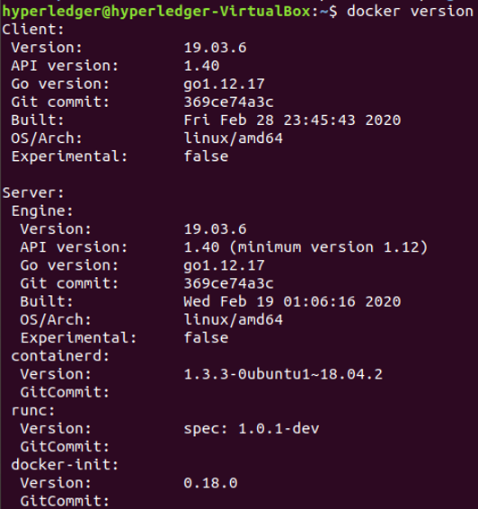
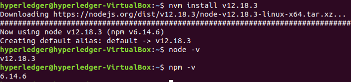

## hyperledger v2.2 localhost network 구축

하이퍼레저 v2.2를 활용하여 단일 host에서 여러개의 컨테이너로 네트워크를 구축함.

* Operating system: 18.04.02 LTS live-server
* Go version: 1.14
* NodeJS version: 12.18.3
* NPM version: 6.14.6
* Channel: mychannel
* Organization: Org1, Org2, Org3
* CA: 1개(Org1)
* DB: CouchDB
* TLS: false
* Consensus Type: Solo

## 1. Docker 설치

```
$ sudo apt install docker.io
$ sudo apt install docker-compose
$ sudo apt install software-properties-common
$ sudo usermod -aG docker $USER
$ sudo reboot
$ docker version 

```
<br>
## 2. nodeJS 설치

```
$ sudo apt-get update 
$ sudo apt-get install build-essential libssl-dev
$curl -sL http://raw.githubusercontent.com/creationix/nvm/v0.31.0/install.sh -o install_nvm.sh
$ bash install_nvm.sh 
$ source ~/.profile
$ sudo reboot
$ nvm install v12.18.3
$ node ?v
$ npm ?v 
```
<br>